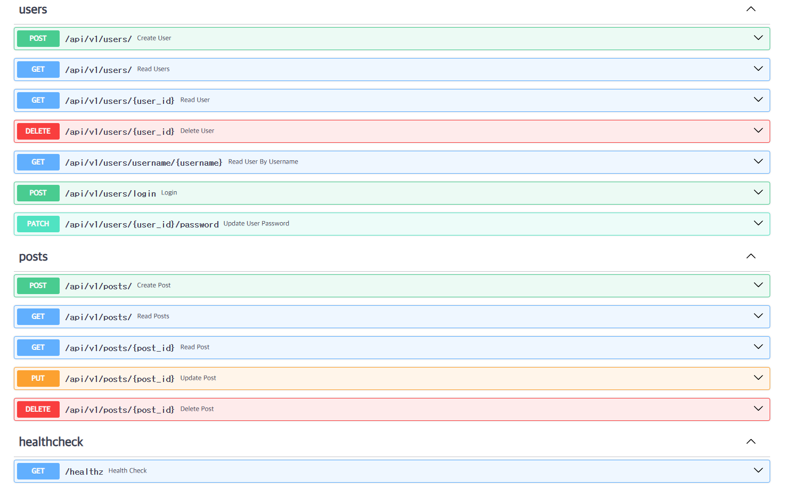
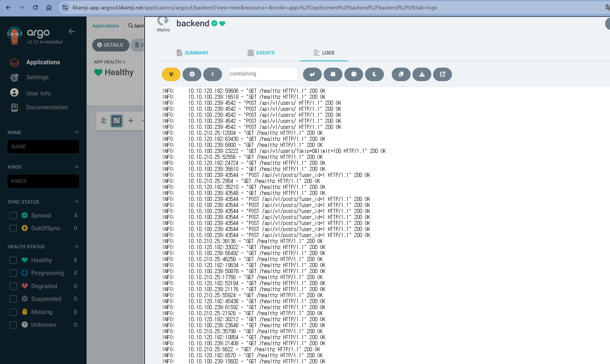

# KKamJi-API

FastAPI로 구현하는 간단한 DB CRUD


## 환경변수

> USE_AWS_SECRETS 환경 변수의 값을 `true`로 지정하면 SECRET_NAME에 해당 하는 Secret에서 DB 연동에 필요한 값을 로드
> `false`로 지정했을 시 시스템 환경변수나 프로젝트의 루트 디렉토리의 .env 파일을 통해 DB 연동에 필요한 값 로드

- `SECRET_NAME`
- `USE_AWS_SECRETS`
- `DATABASE_USERNAME`
- `DATABASE_PASSWORD`
- `DATABASE_HOST`
- `DATABASE_PORT`
- `DATABASE_NAME`

## 실행 방법

### 종속성 설치

``` bash
pip install poetry
poetry install --no-dev --no-interaction --no-ansi
```

### 실행

```bash
uvicorn app.main:app --reload
```

## API 목록

<https://kkamji-app-backend.kkamji.net/docs>



## Health check

<https://kkamji-app-backend.kkamji.net/healthz>

> health check 경로 - /healthz  
> Status Code가 200이 리턴될 시 정상  



## 디렉토리 구조

```bash
❯ tree
.
├── Dockerfile
├── README.md
├── app
│   ├── api
│   │   ├── __init__.py
│   │   ├── health_check.py
│   │   ├── posts.py
│   │   └── users.py
│   ├── config.py
│   ├── core
│   │   ├── __init__.py
│   │   └── security.py
│   ├── database.py
│   ├── main.py
│   ├── models
│   │   ├── post.py
│   │   └── user.py
│   ├── schemas.py
│   └── services
│       ├── post_service.py
│       └── user_service.py
├── docs
│   └── swagger.png
├── poetry.lock
└── pyproject.toml
```
